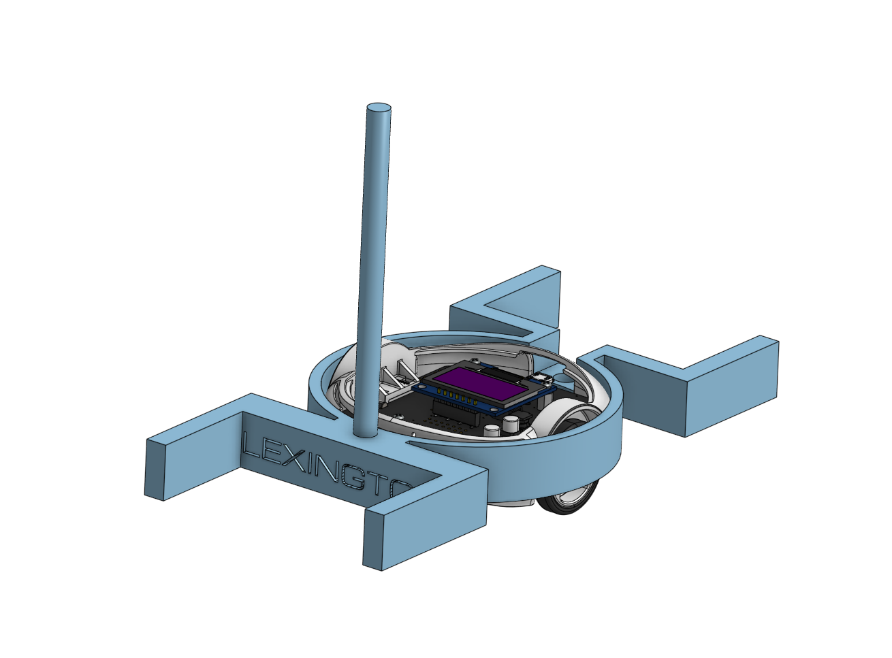

# roto

Firmware for a Science Olympiad **Robot Tour** robot, built on the
[Pololu 3pi+ 32U4](https://www.pololu.com/category/280/3pi-plus-32u4-oled-robot).

The robot drives a pre-programmed route across a grid of 50 cm tiles. It is
paced so the run finishes as close as possible to a target time. Distance comes
from the wheel encoders, heading comes from the on-board gyro, and both are
closed-loop controlled with PID.

<p align="center">
  
</p>

## Results (2025–26 season)

| Competition          | Placement           |
| -------------------- | ------------------- |
| Harvard Invitational | **6th** of 61 teams |
| State Championship   | **4th** of 72 teams |

## How it works

```
 Route (list of moves)
        │
        ▼
 main loop ──► start_command() sets target distance / heading
        │
        ├──► Odometry      encoders → distance, velocity
        │                  gyro     → heading
        │
        ├──► MotionProfile trapezoidal velocity for the current distance
        │
        └──► Controller    velocity PID + feedforward ─┐
                           heading PID ────────────────┴─► left / right motors
```

- **Timing.** `TARGET_TIME` is split evenly across every command, clamped to
  1.0–2.5 s per move. Each move gets a fixed time slot, and the next move
  starts when that slot runs out. This keeps the total run time predictable.
- **Straight moves** follow a trapezoidal velocity profile: accelerate, cruise,
  decelerate. Short moves use a triangular profile. A velocity PID with
  feedforward tracks the profile.
- **Turns** change the target heading by ±90° (or ±45°). The heading PID turns
  the robot in place and holds that heading during the next straight move.
- **Gyro calibration** runs on startup. Keep the robot still while the screen
  shows `Gyro cal`, then press **A** to start the run.

## Project layout

```
main/
├── main.ino              setup(), loop(), command sequencing
└── src/
    ├── Config.h          field, robot, motion and timing constants
    ├── Route.cpp         the route to run (edit this for each field)
    ├── Route.h
    ├── Commands.h        Command type and route shorthands (FF, L90, ...)
    ├── Odometry.h/.cpp   heading, distance and velocity estimation
    ├── MotionProfile.h/.cpp  trapezoidal velocity profile
    ├── Controller.h/.cpp velocity and heading PID control, motor mixing
    ├── PID.h/.cpp        PID controller
    ├── TurnSensor.h/.cpp gyro setup and integration (from Pololu example)
    └── Hardware.h        shared handles to motors, encoders, display, IMU
```

## Building and uploading

Requirements:

- [Arduino IDE](https://www.arduino.cc/en/software) or
  [arduino-cli](https://arduino.github.io/arduino-cli/)
- The **Pololu A-Star Boards** core, installed through the board manager. Its
  package index URL is
  `https://files.pololu.com/arduino/package_pololu_index.json`.
- The **Pololu3piPlus32U4** library, installed through the library manager.

Arduino needs the sketch folder to have the same name as `main.ino`, so clone
the repo into a folder named `main`:

```sh
git clone https://github.com/Bookworm-bit/roto.git main
cd main
arduino-cli compile -b pololu-a-star:avr:a-star32U4 .
arduino-cli upload  -b pololu-a-star:avr:a-star32U4 -p <PORT> .
```

## Writing a route

Routes are lists of shorthand moves in [`src/Route.cpp`](src/Route.cpp):

```cpp
Command commands[] = {
    F6,  FH,       // forward 6 cm, then half a tile
    L90, FF,       // turn left, forward one tile
    R90, FF, BF,   // turn right, forward one tile, back one tile
    ...
};
```

| Macro            | Move                                       |
| ---------------- | ------------------------------------------ |
| `FF` / `BF`      | forward / backward one tile (50 cm)        |
| `FH` / `BH`      | forward / backward half a tile             |
| `F6` / `B6`      | forward / backward 6 cm                    |
| `L90` / `R90`    | turn left / right 90°                      |
| `L45` / `R45`    | turn left / right 45°                      |
| `FD` / `BD`      | half-tile diagonal (use after a 45° turn)  |
| `FFB`, `FHB`, …  | tile moves scaled by `FRICTION`            |

Set the run time with `TARGET_TIME` in [`src/Config.h`](src/Config.h).

## Tuning

Everything you are likely to tune is in one of two places:

- [`src/Config.h`](src/Config.h): max velocity, acceleration and deceleration,
  wheel geometry, and run timing
- [`src/Controller.cpp`](src/Controller.cpp): PID gains
  (`heading_pid`, `velocity_pid`), velocity feedforward, and output limits

## Credits

The gyro code in `src/TurnSensor.*` is taken directly from the `TurnSensor`
example in Pololu's
[Pololu3piPlus32U4 library](https://github.com/pololu/pololu-3pi-plus-32u4-arduino-library).
